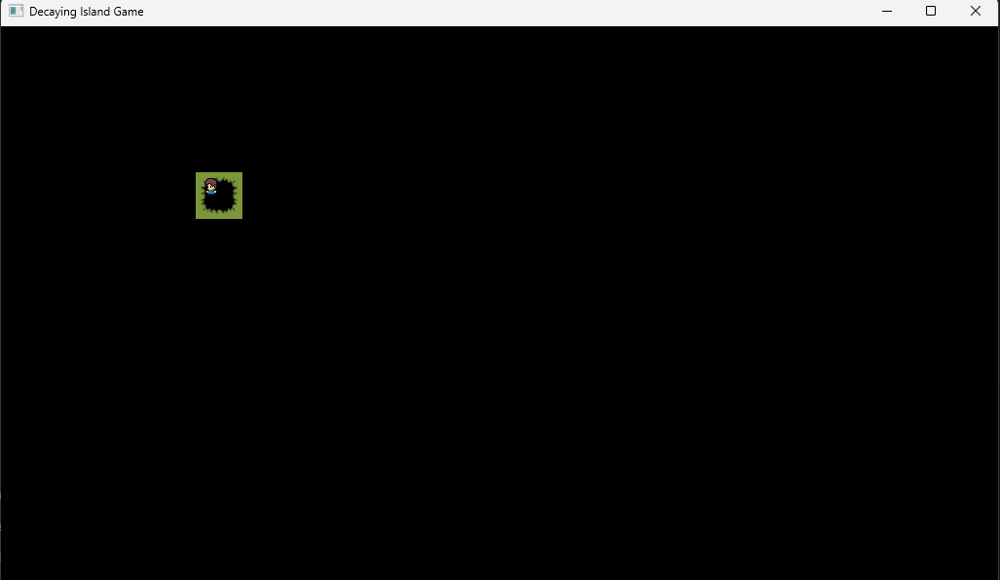
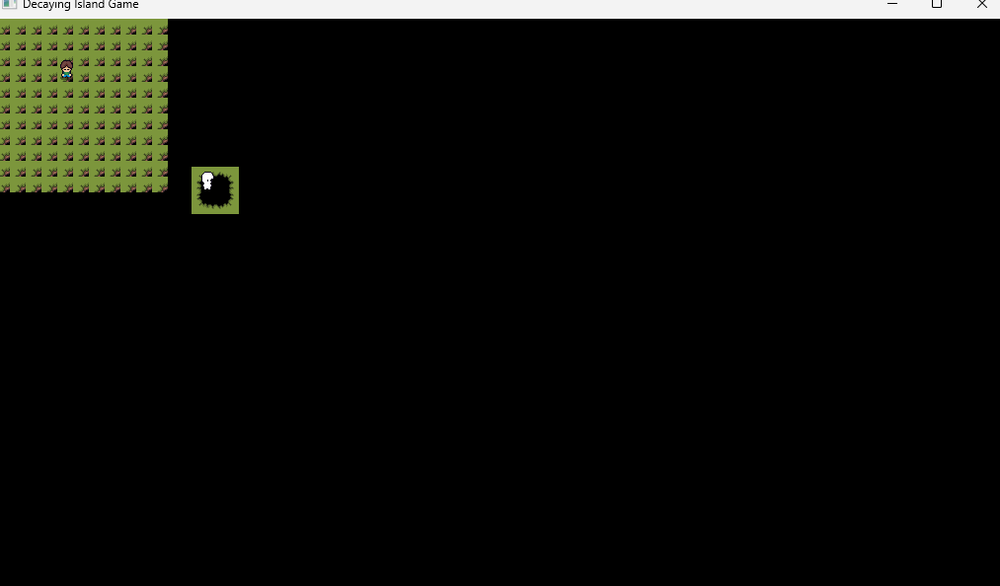

# Unnamed Game Jam
A personal Game Jam challenge.  
**Theme:** Decay.  

I have set myself the goal to produce a playable game within a month around a particular theme, much like a game jam.

The theme has inspired me to make a demo/knock-off of a game under development by YouTuber:  
  
I've been heavily inspired by *Dauphin* and its decay mechanics and cozy, chill nature!

## Assets & Licensing

This game uses the paid version of the asset pack [**Cute Fantasy RPG**](https://kenmi-art.itch.io/cute-fantasy-rpg) by **Kenmi**.  
The asset license does not permit redistribution, so this repository does not include the artwork itself.

A separate binary asset pack will be included with the **demo** and **full game** releases.

---
## Day 4 & 5

Over these two days I had limited time to work on the project, but I still managed to make meaningful progress - particularly on the engine side of things.

**Summary:**
- All texture systems now use TextureMngr::resolve() to fetch, and if needed, lazy-load texture resources. This unifies the way the textures are handled across the game.
- Post-Migration Bugs:
    A few bugs have surfaced since the migrations. Notably,
    - Some runtime errors caused by accessing invalid or nullptr texture pointers. These are currently being tracked down and patched.
    - Certain textures(including the fallback texture) refuse to render correctly when used in a multi-spritesheet object. Investigation is ongoing.
- Planning of future systems:
    - A system-zoomable deadzone camera is being considered to help maintain a cozy atmosphere without the tile art feeling too small or the map needing to be large and empty to accomodate for a fixed window size.
    - early design work on proceedural island generation using Perlin noise + radial falloff. This would serve as a base, with layered noise for mroe advanced terrain features like coves, peninsulas, and ports.
    -Initial design ideas for the entity system, including decorative-only entities that don't require full logic or physics.

**EOD Thoughts**
---
Almost a week in, and I'm still stuck on the texture system. WHile its slower than I'd hoped, I believe getting the texture pipeline is cruical to fast-track the rest of development.

I do feel like I could've acheived more by now. That said, if I can knock out the remaining texture bugs, finish testing, and move into world generation and camera implementation over the next few days, I'll be in a strong positon.
My goal for the nexct week si to:
 - Finalize textures and rendering
 - Implement a procedural island generator.
 - Add the blackbox camera system

 If those systems are in place, I can start working on the entity system and begin populating the world with decorations and interactive elements. That's when thje island will really start to feel alive and cozy.

If I can get this all done in the first two weeks, I should have plenty of time to develop a compelling narrative, add crafting.resource gathering systems, and implement NPCs - all culminating in a polished and atmospheric demo that could serve as the foundation for a full game.

> No screenshots for these days - a;; action was under the hood.

---
## Day 1 – 10-06-2025

**Summary:**
- Created `CMakeLists.txt` & batch file to automate build system requirements
- Requires VCPKG installation with: SDL2, SDL2_image, SDL2_ttf, nlohmann-json
- Implemented a basic window and event management framework
- Began work on texture loading

---

## Day 2 – 11-06-2025

**Summary:**
- Implemented sprite loading
- Implemented spritesheet management
- Implemented animated spritesheets
- Implemented `deltaTime` and a `Timer` class
- Added spritesheet JSON parsing

---
## Day 3 - 12-06-2025

**Summary**
- Implemented AnimatedPlayer class. Still needs some TLC, especially for diagonal movement and potential lerping.
- Started refactoring the texture loader into a singleton and will migrate the Spritesheet class and its children to use this instead of manually ahndling the textures.
- Added a couple more textures and an example tile renderer.

**EOD Post**
---
Three day's in, feeling pretty good with the progress so far. Player animations look great and are customizable by modding the JSON scripts. Hot-loading these scripts would be cool, but is out of the scope for this project. Should implement something similar (but more verbose and forgiving in my engine), perhaps a class that holds all read JSON scripts and allows for hook-in function through lambda calls to allow customisation of how a JSON file is read.

Looking forward to doing proceedural world generation for the island using Perlin/Simplex noise for a height map and using a radial isolation method to form an island like terrain. Would love animated water! and have justt used AI to add texture and grass blades to the base grass texture.

For Day 4, I'm hoping to:
- Finish the TextureMngr implementation adn migrate Spritesheet and its children to the new texture system.
- Start on world generation.
- Add a black-box camera that shifts the map only when the player leaves the defined 'safe-zone'. That should help maintain a cozy, grounded feel. Combined with properly managed entities, it'll make a huge difference.

